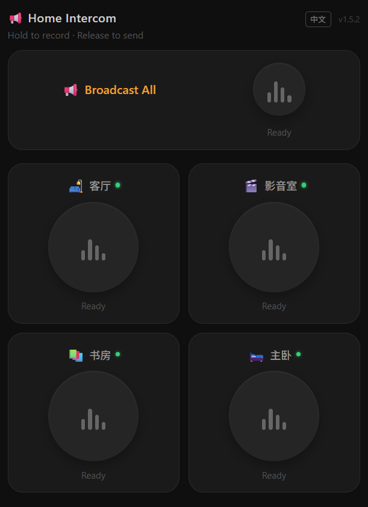

# Home Intercom

Push-to-talk PWA → Home Assistant → smart speakers. Hold a button, say something, it plays on your speakers.

No ffmpeg needed — browser-native recording + pure Python PCM→WAV keeps the Docker image at 131MB.



## How it works

```
Phone PWA → Flask :8764 → Home Assistant API → speakers
                ↕
           rooms.json (config)
```

Flask handles everything: receive audio, wrap PCM as WAV, call HA play_media. No streaming — most smart speakers require complete files to play.

Auto-stop is tiered to match your speakers' capabilities:

1. **Music Assistant players** — native `play_announcement` (fastest, most reliable)
2. **Modern players** — `play_media(announce=True)` with `repeat=off` (HomePod/Chromecast)
3. **Basic players** — timer-based pause after playback (`PAUSE_BUFFER` env)

## Recommended: Use Music Assistant Players

If your speakers are integrated via [Music Assistant](https://music-assistant.io/), **strongly prefer** the `media_player` entities created by the MA integration over native speaker entities.

MA players support the native `play_announcement` service — playback stops automatically. **No timer-based pause needed** (no `PAUSE_BUFFER` config). More reliable, lower latency.

## Deploy

```bash
git clone https://github.com/mdj2812/home-intercom.git
cd home-intercom

# Pre-built image from ghcr.io
export IMAGE=ghcr.io/mdj2812/home-intercom:latest
docker compose -f docker/docker-compose.example.yml up -d

# Or build locally
docker build -f docker/Dockerfile -t home-intercom:latest .
```

Images are built and pushed to ghcr.io by GitHub Actions. To upgrade:

```bash
git pull
docker compose -f docker/docker-compose.example.yml pull
docker compose -f docker/docker-compose.example.yml up -d
```

## Configuration

### Environment variables

| Variable | Description |
|----------|-------------|
| `HA_URL` | Home Assistant URL, e.g. `http://192.168.1.10:8123` |
| `HA_TOKEN` | HA long-lived access token |
| `PUBLIC_URL` | (Optional) Reverse proxy domain for HA to fetch audio |
| `AUDIO_DIR` | Audio storage path, defaults to `/data/audio` |
| `PAUSE_BUFFER` | (Optional) Fallback extra seconds before auto-pause, defaults to `0` |
| `TRUSTED_PROXY` | (Optional) Reverse proxy IP, defaults to `*` (any) |

### rooms.json

```json
{
  "living":  {"name": "Living Room", "entity": "media_player.living_room_speaker", "announce_volume": 50},
  "bedroom": {"name": "Bedroom",    "entity": "media_player.bedroom_speaker"}
}
```

`entity` is the HA entity_id of your speaker. Changes take effect immediately — no restart needed.

`announce_volume` (optional, 0-100) overrides the announcement volume for Music Assistant players only. When set, MA will play a chime then announce at the specified volume. Omit the field to use the player's current volume.

## HTTPS

PWA recording requires HTTPS. Recommended: Caddy reverse proxy.

```Caddyfile
broadcast.your-domain.com {
    reverse_proxy 127.0.0.1:8764
}
```
