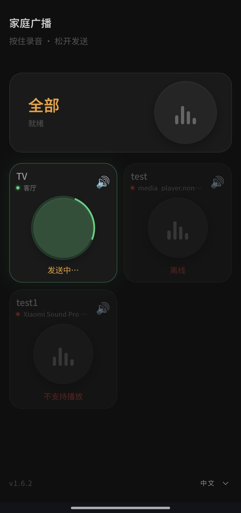

# Home Intercom 家庭广播

手机 PWA 界面，按住说话 → 松开后通过 Home Assistant 在音箱播放。

因为用浏览器原生录音 + PCM→WAV 纯 Python 处理，所以不依赖 ffmpeg，Docker 镜像只有 131MB。



## 架构

```
手机 PWA → Flask :8764 → Home Assistant API → 音箱播放
                ↕
           rooms.json（房间配置）
```

Flask 负责全部：收音频、转 WAV、调 HA 播放。不做流式推送，因为大多数智能音箱只支持完整文件下载后播放。

## 部署

```bash
git clone https://github.com/mdj2812/home-intercom.git
cd home-intercom

# 用预构建镜像
export IMAGE=ghcr.io/mdj2812/home-intercom:latest
docker compose -f docker/docker-compose.example.yml up -d

# 或者本地构建
docker build -f docker/Dockerfile -t home-intercom:latest .
```

镜像由 GitHub Actions 自动构建推到 ghcr.io。升级：

```bash
git pull
docker compose -f docker/docker-compose.example.yml pull
docker compose -f docker/docker-compose.example.yml up -d
```

## 配置

### 环境变量

| 变量 | 说明 |
|------|------|
| `HA_URL` | Home Assistant 地址，如 `http://192.168.1.10:8123` |
| `HA_TOKEN` | HA 长期访问令牌 |
| `PUBLIC_URL` | （可选）反代域名，HA 通过这个 URL 拉音频 |
| `AUDIO_DIR` | 音频存储目录，默认 `/data/audio` |
| `PAUSE_BUFFER` | （可选）自动暂停前的额外等待秒数，默认 `0` |

### rooms.json

```json
{
  "living":  {"name": "客厅", "entity": "media_player.living_room_speaker"},
  "bedroom": {"name": "主卧", "entity": "media_player.bedroom_speaker"}
}
```

`entity` 填 HA 中音箱的 entity_id。改完无需重启，PWA 自动加载。

## HTTPS

PWA 录音需要 HTTPS。推荐 Caddy 反代：

```Caddyfile
broadcast.your-domain.com {
    reverse_proxy 127.0.0.1:8764
}
```
